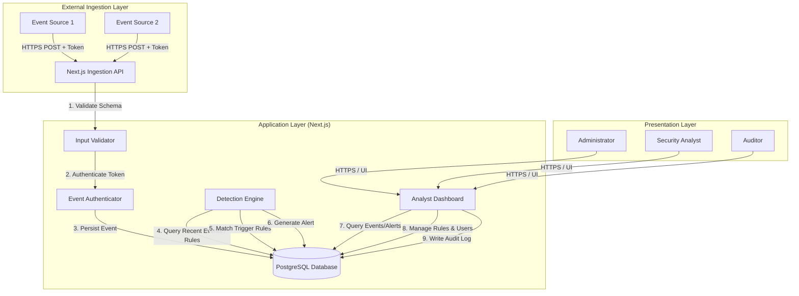
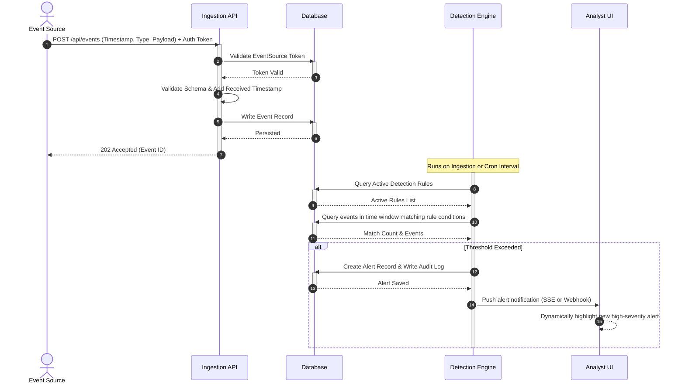

# System Design Specification
## Mini Security Information and Event Management (Mini-SIEM) System

This document outlines the detailed system design, architecture, UML models, and user interface layouts for the Mini-SIEM platform, in accordance with the Phase 2 requirements of the CSCD602 Project Examination.

---

## 1. System Architecture

The System is structured as a decoupled, multi-tiered application to ensure maintainability, security, and portability (**NFR-MAINT-2**, **NFR-PORT-1**).



---

## 2. UML Use Case Diagram

The system supports role-based access control (**FR-6.2**), separating capabilities across four primary actors.

```mermaid
leftToRightDirection
actor EventSource
actor Analyst
actor Administrator
actor Auditor

rectangle Mini-SIEM {
    usecase "UC-1: Submit Security Event" as UC1
    usecase "UC-2: Query Historical Events" as UC2
    usecase "UC-3: Manage Detection Rules" as UC3
    usecase "UC-4: Triage & Resolve Alert" as UC4
    usecase "UC-5: View Security Dashboard" as UC5
    usecase "UC-6: Authenticate User" as UC6
    usecase "UC-7: Manage User Accounts" as UC7
    usecase "UC-8: Review Audit Trail" as UC8
}

EventSource --> UC1
Analyst --> UC2
Analyst --> UC4
Analyst --> UC5
Analyst --> UC6

Administrator --> UC3
Administrator --> UC5
Administrator --> UC6
Administrator --> UC7
Administrator --> UC8

Auditor --> UC2
Auditor --> UC5
Auditor --> UC6
Auditor --> UC8
```

---

## 3. Entity Relationship Diagram (ERD)

The PostgreSQL data model is designed to support event ingestion, append-only security auditing, and rule matching with relational integrity.

```mermaid
erDiagram
    USER {
        string id PK
        string username UNIQUE
        string passwordHash
        string role
        datetime createdAt
    }
    SESSION {
        string id PK
        string userId FK
        string token UNIQUE
        datetime expiresAt
        datetime createdAt
    }
    EVENT_SOURCE {
        string id PK
        string name UNIQUE
        string token UNIQUE
        datetime createdAt
    }
    EVENT {
        string id PK
        datetime timestamp
        datetime receivedAt
        string eventType
        string severity
        string sourceId FK
        json payload
    }
    DETECTION_RULE {
        string id PK
        string name UNIQUE
        string description
        string eventType
        int threshold
        int timeWindow
        string severity
        boolean isActive
        datetime createdAt
    }
    ALERT {
        string id PK
        string ruleName
        string severity
        string status
        string notes
        string eventId FK
        datetime createdAt
    }
    AUDIT_LOG {
        string id PK
        datetime timestamp
        string userId FK
        string action
        string details
    }

    USER ||--o{ SESSION : "has"
    USER ||--o{ AUDIT_LOG : "performs"
    EVENT_SOURCE ||--o{ EVENT : "generates"
    EVENT ||--o{ ALERT : "triggers"
```

---

## 4. Ingestion, Detection, and Alerting Sequence

This model shows the end-to-end flow from programmatic event submission to dynamic analyst alert notification.



---

## 5. UI Layout and Dashboard Wireframe

The Presentation Layer will follow a **premium dark-theme/glassmorphic design** utilizing custom Vanilla CSS to wow the user on first load.

### Layout Outline
```
+-------------------------------------------------------------------------------------------------+
|  🛡️ Mini-SIEM Admin   [Dashboard]  [Events]  [Alerts]  [Settings]                 User: admin (Admin) |
+-------------------------------------------------------------------------------------------------+
|                                                                                                 |
|  SECURITY POSTURE OVERVIEW (Last 24 Hours)                                                      |
|  +-----------------------+  +-----------------------+  +-----------------------+                |
|  |  TOTAL EVENTS         |  |  OPEN ALERTS          |  |  CRITICAL SEVERITY    |                |
|  |  4,821                |  |  12                   |  |  2                    |                |
|  |  [ +12% vs yesterday ]|  |  [ Action Required ]  |  |  [ High Priority ]    |                |
|  +-----------------------+  +-----------------------+  +-----------------------+                |
|                                                                                                 |
|  ACTIVE ALERTS                                                                                  |
|  +-------------------------------------------------------------------------------------------+  |
|  | Severity | Trigger Time        | Rule Name           | Target Source  | Status     | Actions  |  |
|  |----------|---------------------|---------------------|----------------|------------|----------|  |
|  | CRITICAL | 2026-08-13 22:38:00 | Brute Force Login   | Auth-Gateway   | NEW        | [Triage] |  |
|  | HIGH     | 2026-08-13 22:36:12 | Priv Escalation     | Prod-Server-01 | INVEST...  | [Triage] |  |
|  | MEDIUM   | 2026-08-13 22:31:05 | Multi-Source Login  | User-API       | RESOLVED   | [View]   |  |
|  +-------------------------------------------------------------------------------------------+  |
|                                                                                                 |
+-------------------------------------------------------------------------------------------------+
```

### Design tokens:
* **Backgrounds:** Rich deep charcoal (`#0d0e12`) with frosted-glass containers (`rgba(255, 255, 255, 0.03)` with backdrop-filter blur).
* **Typography:** Modern, clean sans-serif (Inter/Roboto) with distinct weights.
* **Semantic Accent Colors:**
  * **Critical:** Vibrant Red/Crimson (`#ef4444`)
  * **High:** Bright Amber/Orange (`#f97316`)
  * **Medium:** Warm Gold/Yellow (`#eab308`)
  * **Low/Info:** Crisp Cyan/Blue (`#06b6d4`)
