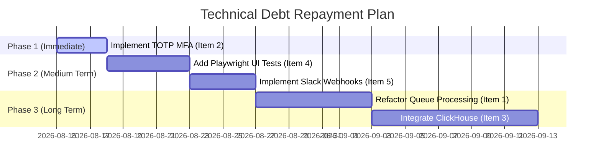

# Technical Debt Identification and Management Plan
## Mini Security Information and Event Management (Mini-SIEM) System

**Document ID:** DEBT-MSIEM-001  
**Version:** 1.0  
**Prepared For:** CSCD602: Advanced Software Engineering — Individual Project-Based Examination  
**Prepared By:** [Student Name] — [Student ID]  
**Date:** [Submission Date]  

---

## 1. Introduction

As a project developed within a fixed 48-hour academic examination window, the Mini-SIEM platform was subjected to significant schedule constraints. To deliver a functional, end-to-end working system (ingestion, rule matching, alerts, UI dashboard, and cryptographically chained event hashing), engineering trade-offs were made.

This document identifies, prioritizes, and classifies the resulting **Technical Debt** (in accordance with Section 7 of the Exam Guidelines) and details a structured **Repayment Plan** to address these items in future iterations.

---

## 2. Technical Debt Registry

The identified technical debt items are categorized below using the format:  
**Debt Name → Root Cause → Operational/Security Impact → Priority → Proposed Resolution**

---

### Item 1: Lack of Real-Time Event Streaming (Polling-Based Detection Engine)
* **Debt:** The Detection Engine runs periodically (polling db queries) rather than processing events as a stream in real-time.
* **Cause:** The 48-hour time constraint prevented setting up a persistent WebSocket, Server-Sent Events (SSE), or Apache Kafka/Redis pub-sub stream listener architecture.
* **Impact:** High latency in alerting (mean time to detect is delayed by the polling interval, e.g., 10–30 seconds), leading to a slower incident response window.
* **Priority:** **Medium (Scheduled for Future Resolution)**
* **Proposed Resolution:** Refactor the ingestion route to publish incoming events to an in-memory queue (e.g. BullMQ, Redis Stream) and trigger the detection logic asynchronously via worker threads.

---

### Item 2: Lack of Multi-Factor Authentication (MFA)
* **Debt:** User logins rely solely on single-factor password authentication.
* **Cause:** 48-hour development window was prioritized around core SIEM ingestion and alert auditing capabilities, leaving multi-factor auth integrations out of scope.
* **Impact:** Potential vulnerability to credentials theft/compromise if analyst accounts are breached.
* **Priority:** **High (Critical and requiring immediate attention)**
* **Proposed Resolution:** Implement standard Time-Based One-Time Password (TOTP) MFA (using libraries like `otplib` and QR code generator) for all administrative and analyst roles.

---

### Item 3: Local SQLite/PostgreSQL Database Scaling Limitations
* **Debt:** Ingestion and rules query scaling depend entirely on database indexing, lacking a full-text search engine or log storage database (e.g. Elasticsearch/ClickHouse).
* **Cause:** Simplified architecture designed for lightweight, single-instance deployment within the examination period.
* **Impact:** Significant slowdown in event query search times once historical records exceed 1,000,000 rows.
* **Priority:** **Low (Acceptable Temporarily)**
* **Proposed Resolution:** Integrate a dedicated columnar store or logs database like ClickHouse or Elasticsearch to handle multi-terabyte log indexing.

---

### Item 4: Absence of Automated End-to-End (E2E) Browser Tests
* **Debt:** Verification relies entirely on API-level integration tests (`test-verification.js`) and manual user interface checks, lacking automated browser suites (e.g. Playwright or Cypress).
* **Cause:** Limited time during Phase 4 (Testing & Refinement).
* **Impact:** High risk of regression styling bugs or login flow breakage during future UI updates.
* **Priority:** **Medium (Scheduled for Future Resolution)**
* **Proposed Resolution:** Create a Cypress/Playwright configuration folder with automated specs verifying the login page rendering, validation prompts, password toggle triggers, and dashboard layout.

---

### Item 5: Lack of Dynamic Alert Channels (Webhooks/Email Notifications)
* **Debt:** Alerts are only visible within the active analyst dashboard UI, with no push notifications to external channels.
* **Cause:** Design shortcut chosen to limit external integrations within the 48-hour period.
* **Impact:** Incident responders must actively poll or keep the UI open to receive alert states.
* **Priority:** **Medium (Scheduled for Future Resolution)**
* **Proposed Resolution:** Implement a webhook notification service in `/api/alerts` to send critical alert payloads automatically to platforms like Slack, Discord, or Twilio SendGrid (email).

---

## 3. Repayment Schedule

The roadmap for repaying the registered technical debt is structured across three target phases:

This repayment schedule ensures that critical security items are resolved immediately, followed by test automation, before expanding the platform's architectural scaling limits.
